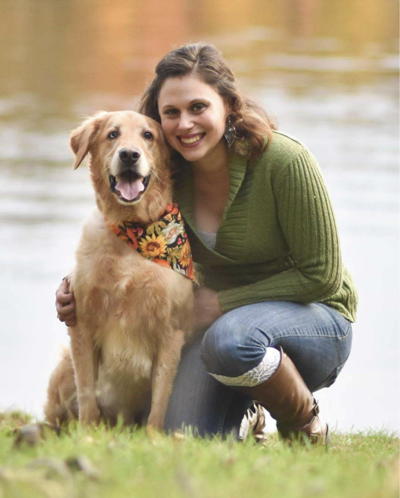

```{=html}
<!-- ── PAGE HEADER ────────────────────────────────────────────────────────────── -->
<section class="page-header">
  <div class="page-header-text">
    <div class="page-header-inner">
      <p class="page-header-label">Innovative Assessment Solutions</p>
      <div class="page-header-h1" role="heading" aria-level="1">About IAS &amp; the Team</div>
      <p class="page-header-sub">A small psychometrics firm building assessments that teachers can actually use.</p>
    </div>
  </div>
  <div class="page-header-image" style="background-image:url('assets/images/pexels-fauxels-3184468-1.jpg');"></div>
</section>

<!-- ── IAS INTRO ──────────────────────────────────────────────────────────────── -->
<section class="section-white">
  <div class="section-container" style="text-align:center;">
    <h2 class="section-heading">Who We Are</h2>
    <hr class="section-divider">
    <p style="max-width:820px; margin:0 auto; color:#555; font-size:1rem; line-height:1.85;">
      Founded in 2020, Innovative Assessment Solutions is an assessment company dedicated to making
      assessments more informative, actionable, and useful in educational settings. We combine
      novel psychometric methods with advanced data analytics, and we work directly with districts
      and state agencies. Our team's insights come from decades of experience across every phase
      of assessment development&mdash;and from partnerships with the districts and states
      actually using our tools.
    </p>
  </div>
</section>

<!-- ── TEAM INTRO ─────────────────────────────────────────────────────────────── -->
<section class="section-light">
  <div class="section-container" style="text-align:center;">
    <h2 class="section-heading">Meet Our Team</h2>
    <hr class="section-divider">
    <p style="max-width:780px; margin:0 auto 48px; color:#555; font-size:1rem; line-height:1.85;">
      IAS is deliberately a small team. Every engagement includes direct access to the
      psychometricians who built the platform&mdash;not a sales representative who forwards
      technical questions to a queue.
    </p>

    <div style="display:grid; grid-template-columns:repeat(3,1fr); gap:28px; text-align:left;">

      <!-- Jonathan Templin -->
      <div>
        <div class="team-card">
          <div class="team-photo-wrap">
            
          </div>
          <div class="team-card-body">
            <h3>Jonathan Templin, Ph.D.</h3>
            <p class="team-role">IAS Co-Founder</p>
            <p>
              Jonathan is the Eugene T. Moore Endowed Professor in the Education and Human
              Development Department of the College of Education at Clemson University. His
              research focuses on the development of psychometric and general quantitative methods,
              as applied in the psychological, educational, and social sciences. He leads the
              psychometric work behind Astra.
            </p>
          </div>
        </div>
      </div>

      <!-- Anne Wilson -->
      <div>
        <div class="team-card">
          <div class="team-photo-wrap">
            
          </div>
          <div class="team-card-body">
            <h3>Anne Wilson, MBA</h3>
            <p class="team-role">IAS Co-Founder</p>
            <p>
              Anne's accounting career is rooted in both the public and private sectors, and
              includes 20+ years at the University of Iowa. She enjoys enacting process
              improvements and manages IAS operations.
            </p>
          </div>
        </div>
      </div>

      <!-- Jacinta Olson -->
      <div>
        <div class="team-card">
          <div class="team-photo-wrap">
            
          </div>
          <div class="team-card-body">
            <h3>Jacinta Olson, Ph.D.</h3>
            <p class="team-role">Senior Psychometrician</p>
            <p>
              Jacinta has over five years of experience teaching mathematics in Iowa and Arizona.
              She blends educational measurement, cognitive psychology, and educational practices
              to create well-designed assessments that serve as powerful tools for tailoring
              instruction and optimizing student success.
            </p>
          </div>
        </div>
      </div>

    </div>
  </div>
</section>

```
