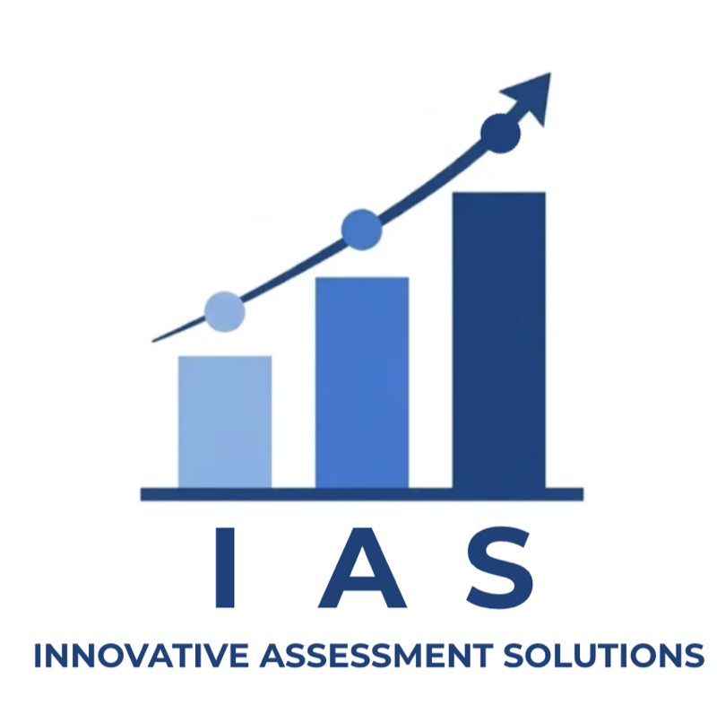
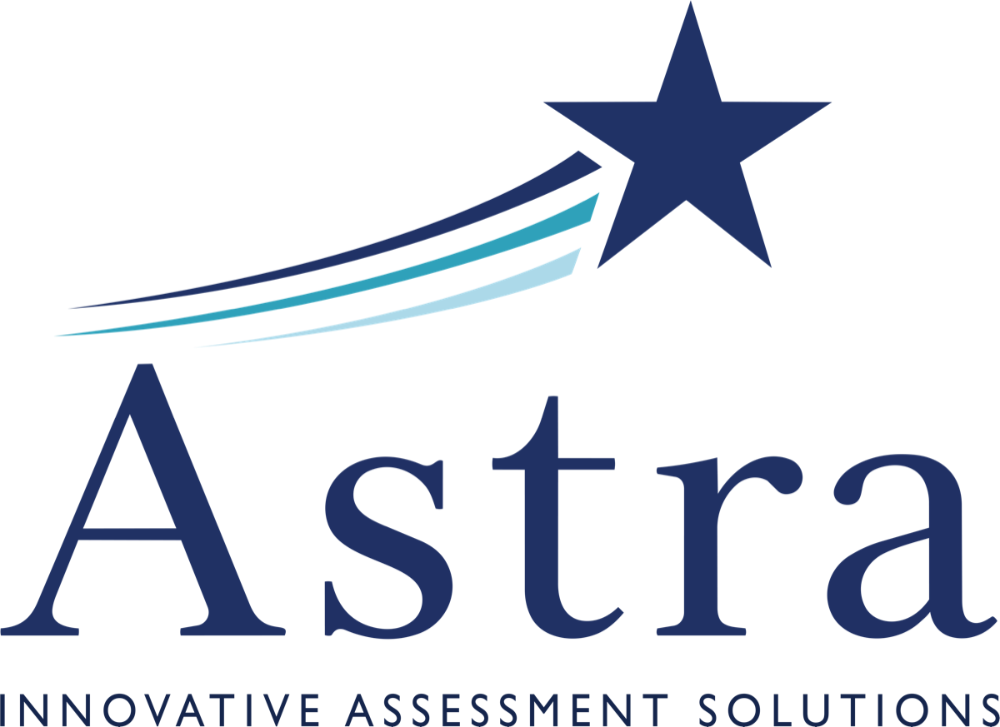

```{=html}
<!-- ── HERO ─────────────────────────────────────────────────────────────────── -->
<section class="ias-hero" style="
  background-image: url('assets/images/pexels-fauxels-3184468-1.jpg');
  background-size: cover;
  background-position: center;
  position: relative;">
  <div style="position:absolute; inset:0; background:linear-gradient(135deg, rgba(0,16,46,0.85) 0%, rgba(35,52,82,0.80) 100%);"></div>
  <div class="section-container" style="position:relative; z-index:1;">
    <div class="ias-hero-h1" role="heading" aria-level="1">Actionable Assessment Data</div>
    <p class="hero-subtitle">Meet Astra: Curriculum-aligned, standard-specific,<br>delivered in time to change instruction</p>
    <div style="display:flex; gap:16px; justify-content:center; flex-wrap:wrap;">
      <a href="astra-assessments.qmd" class="btn-ias">Explore Astra</a>
      <a href="contact.qmd" class="btn-ias-outline">Get in Touch</a>
    </div>
  </div>
</section>

<!-- ── VISION & MISSION ───────────────────────────────────────────────────────── -->
<section class="section-light" style="padding-top:clamp(60px,6vw,80px); padding-bottom:clamp(60px,6vw,80px);">
  <div class="section-container" style="text-align:center;">
    
    <h2 class="section-heading">Our Vision and Mission</h2>
    <hr class="section-divider">
    <p style="max-width:740px; margin:0 auto; color:#555; font-size:1rem; line-height:1.85;">
      Our mission is to build assessments that turn student data into instructional action.
      Whether through Astra&mdash;our flagship through-year system in Kansas&mdash;or through
      direct partnerships with assessment vendors, districts, and states, IAS delivers assessment
      data educators can actually use to guide instruction, accelerate learning, and improve
      results.
    </p>
    <div style="margin-top:36px;">
      <a href="about.qmd" class="btn-ias">Meet Our Team</a>
    </div>
  </div>
</section>

<!-- ── ASTRA SPOTLIGHT—PIVOT TO KANSAS ────────────────────────────────────── -->
<section class="astra-spotlight">
  <div class="section-container">
    <div class="astra-spotlight-grid">
      <div>
        <p class="astra-spotlight-eyebrow">Our Kansas work</p>
        <h2>Astra: a through-year assessment system built in Kansas, specifically for Kansas</h2>
        <p class="lead">
          Astra is IAS's flagship assessment product—a quarterly benchmark platform aligned to
          each district's scope and sequence, developed in partnership with the Kansas districts.
          We release all assessment items and feature standard-level item response reports that
          arrive within days of each administration. Our quarterly composite scores explain
          70–90% of the variance in end-of-year KAP scores.
        </p>
        <div style="display:flex; gap:14px; flex-wrap:wrap;">
          <a href="astra-assessments.qmd" class="btn-ias">Astra Assessments</a>
          <a href="cohort.qmd" class="btn-ias-outline">2026–27 Kansas Cohort</a>
        </div>
      </div>
      <div class="astra-spotlight-mark">
        
        <div class="mark-caption">Ad Astra Per Aspera</div>
      </div>
    </div>
  </div>
</section>

<!-- ── CTA ────────────────────────────────────────────────────────────────────── -->
<section class="cta-banner">
  <div class="section-container">
    <h2>Ready to Revolutionize Your Assessments?</h2>
    <p>
      Whether you are a Kansas district exploring the 2026–27 Astra cohort or a outside of Kansas
      wanting to bring the power of our assessments to your state, we would like to hear from you.
    </p>
    <div style="display:flex; gap:16px; justify-content:center; flex-wrap:wrap;">
      <a href="contact.qmd" class="btn-ias">Start the Conversation</a>
    </div>
  </div>
</section>

```
